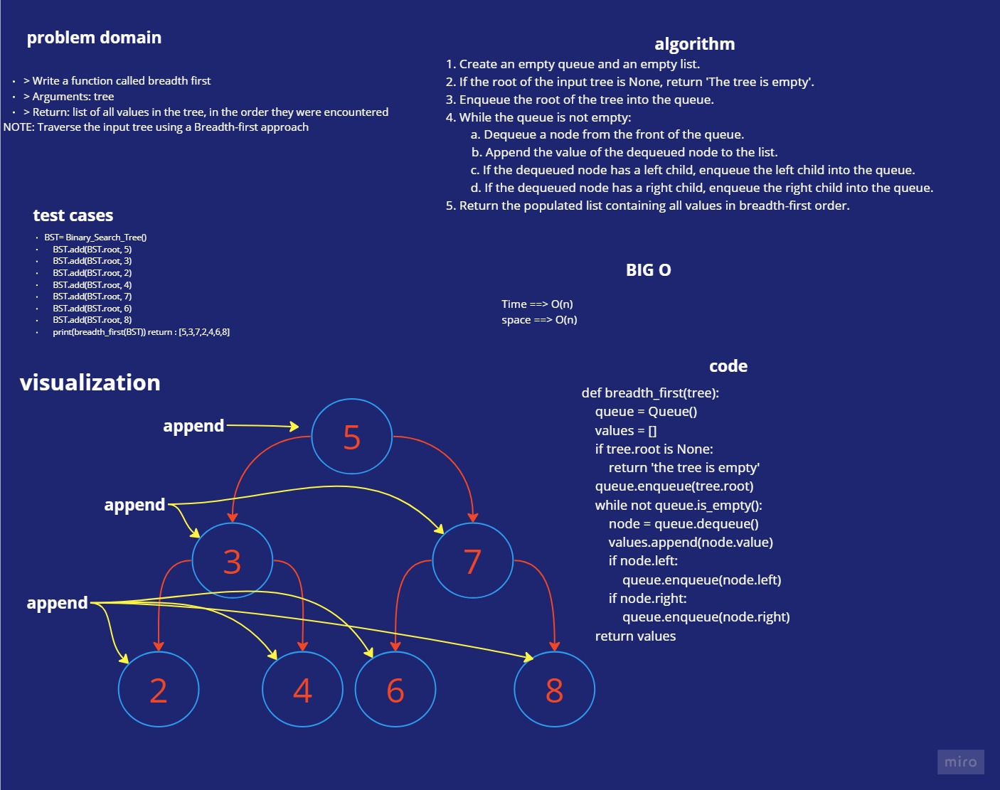

# Breadth-first Traversal.

> Write a function called breadth first
> Arguments: tree
> Return: list of all values in the tree, in the order they were encountered
> NOTE: Traverse the input tree using a Breadth-first approach

# Whiteboard Process

## white-board for breadth_first

# Approach & Efficiency

## big O for breadth_first
>Time ==> O(n) 
>space ==> O(n) 

# Solution

    def breadth_first(tree):
        """
        Perform breadth-first traversal on a binary tree and return a list of its values.

        Args:
            tree: The binary tree to traverse.

        Returns:
            A list of values in the binary tree in breadth-first order.
        """
        queue = Queue()
        values = []
        if tree.root is None:
            return 'the tree is empty'
        queue.enqueue(tree.root)
        while not queue.is_empty():
            node = queue.dequeue()
            values.append(node.value)
            if node.left:
                queue.enqueue(node.left)
            if node.right:
                queue.enqueue(node.right)
        return values