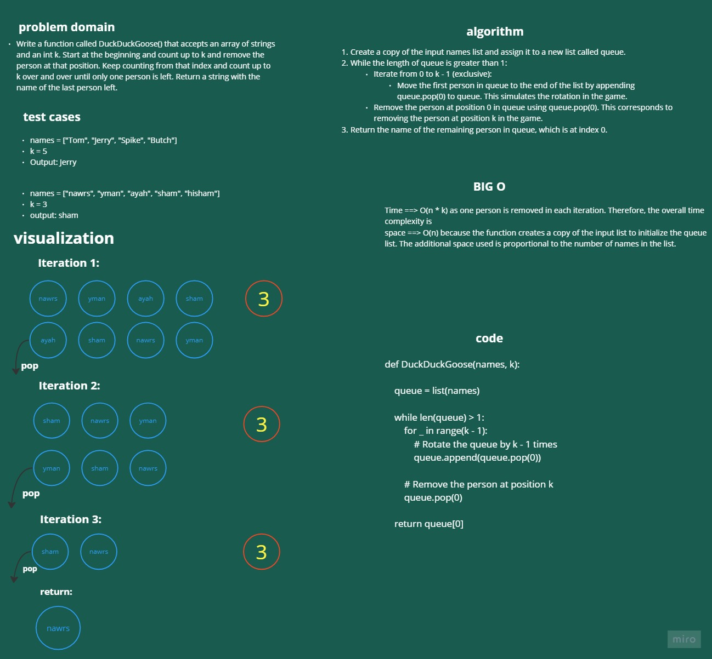

# Duck Duck Goose

Write a function called DuckDuckGoose() that accepts an array of strings and an int k. Start at the beginning and count up to k and remove the person at that position. Keep counting from that index and count up to k over and over until only one person is left. Return a string with the name of the last person left.

# Whiteboard Process



# Approach & Efficiency

> Time ==> O(n * k) as one person is removed in each iteration. Therefore, the overall time complexity is
> space ==> O(n) because the function creates a copy of the input list to initialize the queue list. The additional space used is proportional to the number of names in the list.

# Solution

```
def DuckDuckGoose(names, k):
    """
    Determines the last person standing in a Duck Duck Goose game.

    Args:
        names (list): A list of strings representing the names of the players.
        k (int): An integer representing the counting interval.

    Returns:
        str: The name of the last person remaining in the game.

    """
    queue = list(names)

    while len(queue) > 1:
        for _ in range(k - 1):
            # Rotate the queue by k - 1 times
            queue.append(queue.pop(0))

        # Remove the person at position k
        queue.pop(0)

    return queue[0]

```
