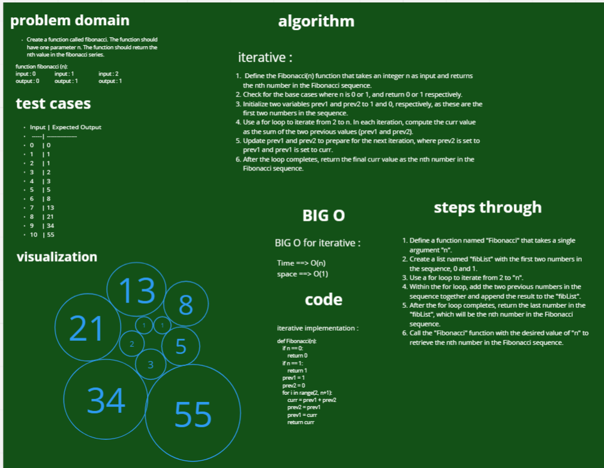

# Fibonacci 
Create a function called fibonacci. The function should have one parameter n. The function should return the nth value in the fibonacci series.

# Whiteboard Process

# Approach & Efficiency

## Approach:
Initialize two variables "a" and "b" to 0 and 1 respectively.
Use a for loop to iterate from 2 to "n".
Within the for loop, calculate the next number in the sequence by adding "a" and "b", and store the result in a temporary variable.
Update the values of "a" and "b" to the previous two numbers in the sequence.
After the for loop completes, return the value of "b", which will be the nth number in the Fibonacci sequence.

## Efficiency:
Time Complexity: O(n), where n is the input number. This is because we need to iterate through the loop n times to generate the nth number in the Fibonacci sequence.
Space Complexity: O(1), because we only need to store the values of "a" and "b" at each iteration.

# Solution

    def Fibonacci(n):
        if n == 0:
            return 0
        if n == 1:
            return 1
        prev1 = 1
        prev2 = 0
        for i in range(2, n+1):
            curr = prev1 + prev2
            prev2 = prev1
            prev1 = curr
            return curr

