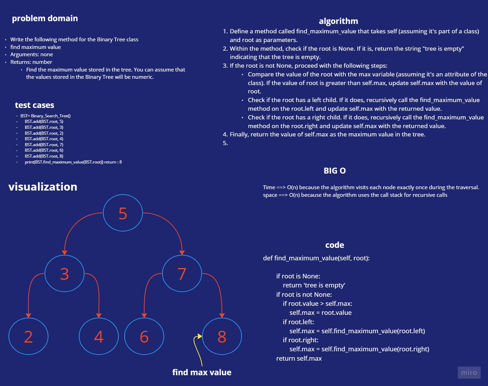

# Maximum Value in a Binary Tree

## find_maximum_value

Write the following method for the Binary Tree class

find maximum value
Arguments: none
Returns: number
Find the maximum value stored in the tree. You can assume that the values stored in the Binary Tree will be numeric.

# Whiteboard Process

## white-board for pre_order

# Approach & Efficiency

## big O for find_maximum_value
>Time ==> O(n) because the algorithm visits each node exactly once during the traversal.
>space ==> O(n) because the algorithm uses the call stack for recursive calls

# Solution

    def find_maximum_value(self, root):
        '''
        Finds the maximum value in the tree.

        this function travers into the tree and compare the root value with the max_value variable and if the root is bigger the variable will take the value of the root

        Args:
        root: The root node of the current traversal.

        Returns:
        The maximum value in the tree.
        '''
        if root is None:
            return 'tree is empty'
        if root is not None:
            if root.value > self.max:
                self.max = root.value
            if root.left:
                self.max = self.find_maximum_value(root.left)
            if root.right:
                self.max = self.find_maximum_value(root.right)
        return self.max
        