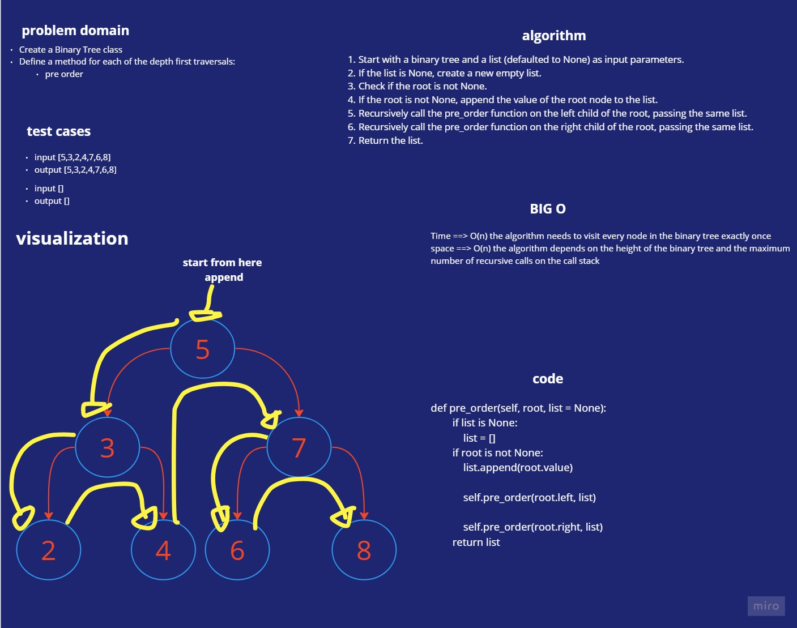
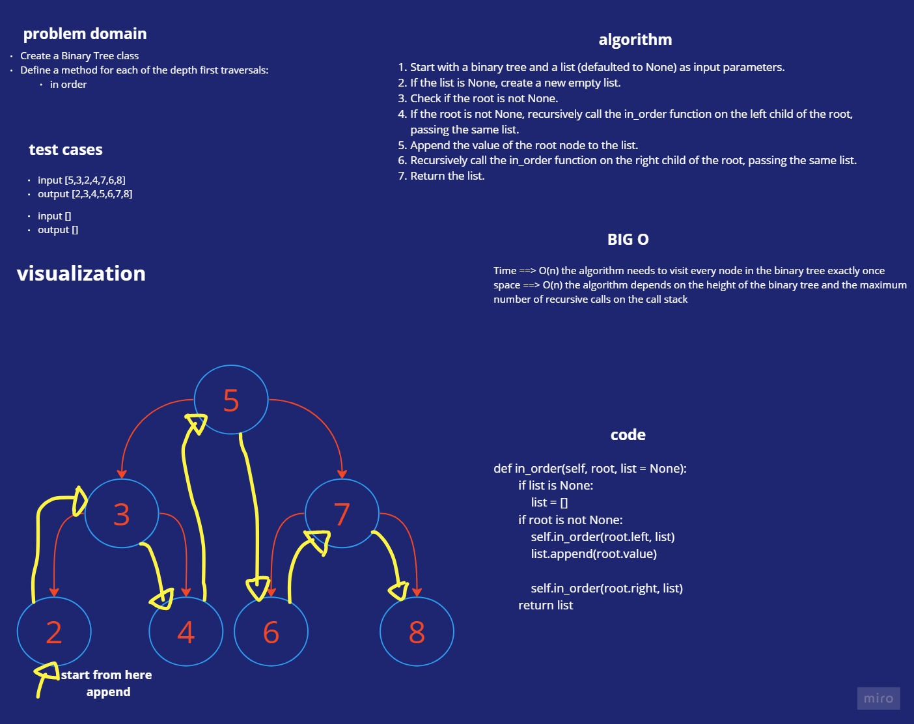
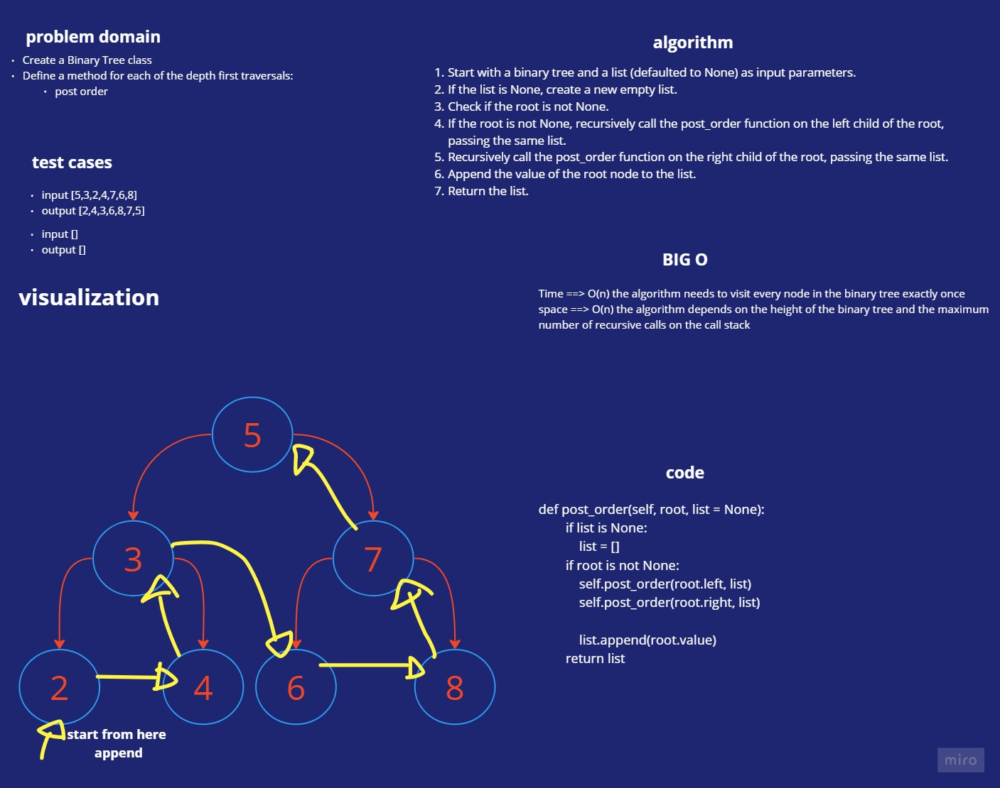
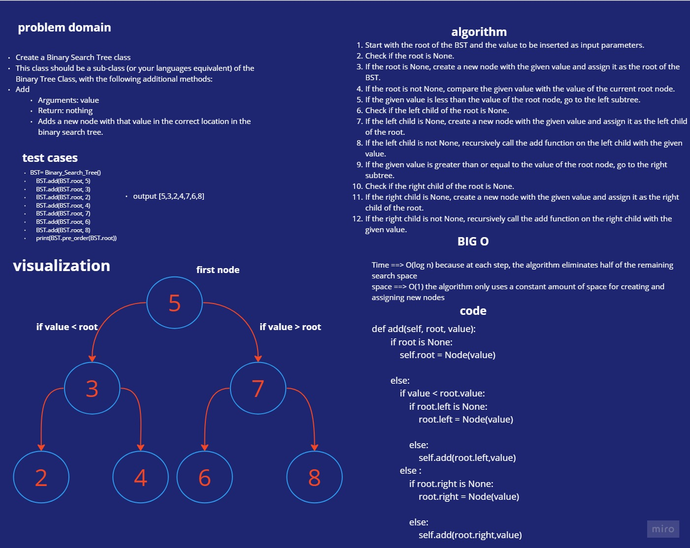
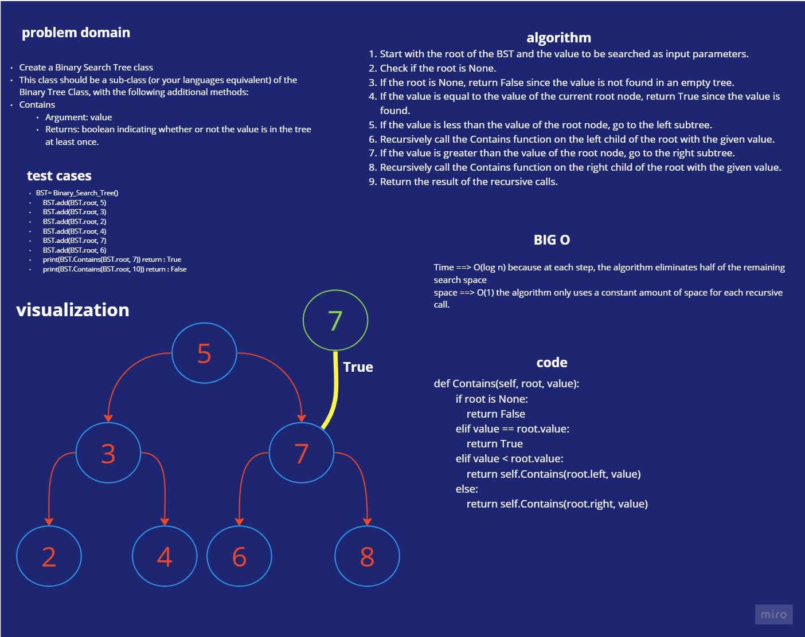

# Trees
## Node
>Create a Node class that has properties for the value stored in the node, the left child node, and the right child node.
## Binary Tree
> Create a Binary Tree class
Define a method for each of the depth first traversals:
pre order
in order
post order
Each depth first traversal method should return an array of values, ordered appropriately.
## Binary Search Tree
Create a Binary Search Tree class
This class should be a sub-class (or your languages equivalent) of the Binary Tree Class, with the following additional methods:
Add
Arguments: value
Return: nothing
Adds a new node with that value in the correct location in the binary search tree.
Contains
Argument: value
Returns: boolean indicating whether or not the value is in the tree at least once.

# Whiteboard Process

## white-board for pre_order

## white-board for in_order

## white-board for post_order

## white-board for Add

## white-board for Contains

# Approach & Efficiency

## big O for pre_order
>Time ==> O(n) the algorithm needs to visit every node in the binary tree exactly once
>space ==> O(n) the algorithm depends on the height of the binary tree and the maximum number of recursive calls on the call stack

## big O for in_order
>Time ==> O(n) the algorithm needs to visit every node in the binary tree exactly once
>space ==> O(n) the algorithm depends on the height of the binary tree and the maximum number of recursive calls on the call stack

## big O for post_order
>Time ==> O(n) the algorithm needs to visit every node in the binary tree exactly once
>space ==> O(n) the algorithm depends on the height of the binary tree and the maximum number of recursive calls on the call stack
## big O for Add
>Time ==> O(log n) because at each step, the algorithm eliminates half of the remaining search space
>space ==> O(1) the algorithm only uses a constant amount of space for creating and assigning new nodes

## big O for Contains
>Time ==> O(log n) because at each step, the algorithm eliminates half of the remaining search space
>space ==> O(1) the algorithm only uses a constant amount of space for each recursive call.

# Solution

    class Node:
        def __init__(self, value):
            self.value = value
            self.left = None
            self.right = None

    class Tree:
        def __init__(self):
            self.root = None

        def pre_order(self, root, list = None):
            if list is None:
                list = []
            if root is not None:
                list.append(root.value)
            
                self.pre_order(root.left, list)
            
                self.pre_order(root.right, list)
            return list

        def in_order(self, root, list = None):
            if list is None:
                list = []
            if root is not None:
                self.in_order(root.left, list)

                list.append(root.value)

                self.in_order(root.right, list)
            return list
        
        def post_order(self, root, list = None):
            if list is None:
                list = []
            if root is not None:
                self.post_order(root.left, list)

                self.post_order(root.right, list)

                list.append(root.value)
            return list
        
    class Binary_Search_Tree(Tree): # inhertenc
        def __init__(self):
            super().__init__()# to pass everything that is need to be done from the parents
            
        def add(self, root, value):

            if root is None: # root from bst.root will take the root of def __init__ 
                # print(root)
                self.root = Node(value)
                
            else:
                if value < root.value:
                    if root.left is None:
                        root.left = Node(value)
                    
                    else:
                        self.add(root.left,value)
                else :
                    if root.right is None:
                        root.right = Node(value)
                    
                    else:
                        self.add(root.right,value)
            
        def Contains(self, root, value):
            if root is None:
                return False
            elif value == root.value:
                return True
            elif value < root.value:
                return self.Contains(root.left, value)
            else:
                return self.Contains(root.right, value)

    # if __name__ == '__main__':
    #     bst = Binary_Search_Tree()
    #     bst.add(bst.root ,6)
    #     bst.add(bst.root ,3)
    #     bst.add(bst.root ,7)
    #     bst.add(bst.root ,1)
    #     bst.add(bst.root ,4)
    #     bst.add(bst.root ,9)
    #     print(bst.root.value)
    #     print(bst.pre_order(bst.root))
    #     print(bst.in_order(bst.root))
    #     print(bst.post_order(bst.root))

    #     print(bst.Contains(bst.root, 7))
    #     print(bst.Contains(bst.root, 10))