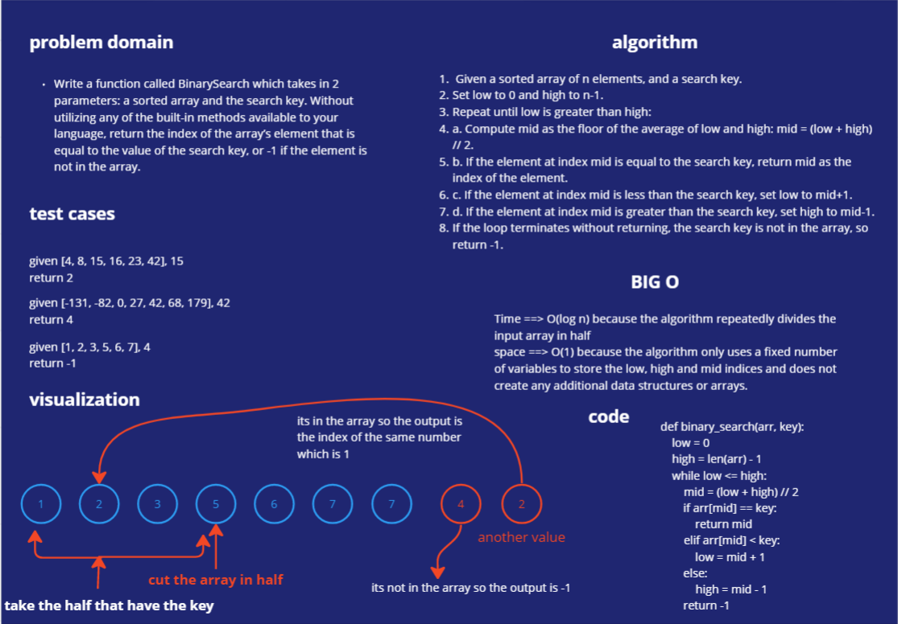

# array-binary-search
Write a function called BinarySearch which takes in 2 parameters: a sorted array and the search key. Without utilizing any of the built-in methods available to your language, return the index of the array’s element that is equal to the value of the search key, or -1 if the element is not in the array.
NOTE: The search algorithm used in your function should be a binary search.
Check the Resources section for details

# Whiteboard Process

# Approach & Efficiency

## Approach:

The approach of the binary search algorithm is to divide the input array into two halves repeatedly until the search key is found or the subarray size becomes 0. The search key is compared with the middle element of the array, and based on the comparison, either the left or right half of the array is selected for further search.

## Efficiency:

The time complexity of the binary search algorithm is O(log n), where n is the number of elements in the input array. This is because in each iteration of the algorithm, the size of the search space is reduced by half. The space complexity of the algorithm is O(1), as it only uses a constant amount of additional space to store the low, high, and mid variables.

# Solution

    def binary_search(arr, key):
        low = 0
        high = len(arr) - 1

        while low <= high:
            mid = (low + high) // 2

            if arr[mid] == key:
                return mid
            elif arr[mid] < key:
                low = mid + 1
            else:
                high = mid - 1

        return -1

# example 

##  #Define a sorted array to search
    arr = [1, 2, 3, 4, 5, 6, 7, 8, 9]

##  #Define a search key
    search_key = 5

##  #Call the binary_search function and store the result in a variable
    result = binary_search(arr, search_key)

##  #Check if the search key was found in the array
    if result != -1:
        print(f"The search key {search_key} was found at index {result}")
    else:
        print(f"The search key {search_key} was not found in the array")

