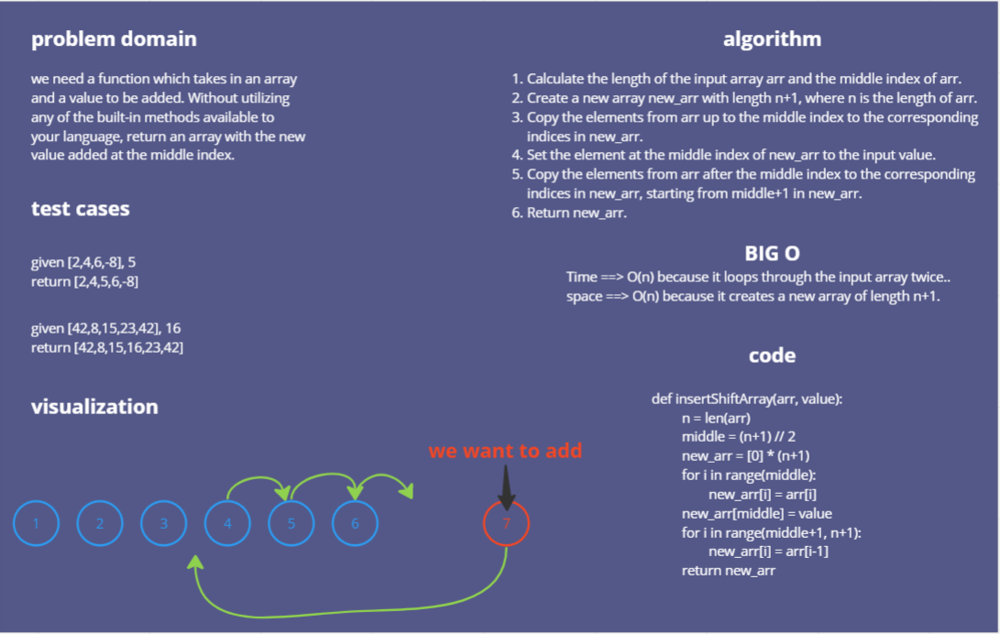

# array-insert-shift
we need a function which takes in an array and a value to be added. Without utilizing any of the built-in methods available to your language, return an array with the new value added at the middle index.

# Whiteboard Process

# Approach & Efficiency

## Approach:
The add_value_to_middle function creates a new array of length n+1, where n is the length of the input array. It then loops through the first half of the input array to copy the elements to the new array, inserts the new value in the middle of the new array, and loops through the second half of the input array to copy the remaining elements to the new array.

## Efficiency:
This function has a time complexity of O(n), where n is the length of the input array, because it loops through the input array twice. The space complexity is also O(n), because it creates a new array of length n+1.

# Solution

def insertShiftArray(arr, value):

  n = len(arr)

  middle = (n+1) // 2

  new_arr = [0] * (n+1)

  for i in range(middle):

    new_arr[i] = arr[i]

    new_arr[middle] = value

  for i in range(middle+1, n+1):

    new_arr[i] = arr[i-1]

  return new_arr

## example :

arr = [1, 2, 3, 4, 5]

value = 6

new_arr = insertShiftArray(arr, value)

print(new_arr) 

## Output: [1, 2, 3, 6, 4, 5]