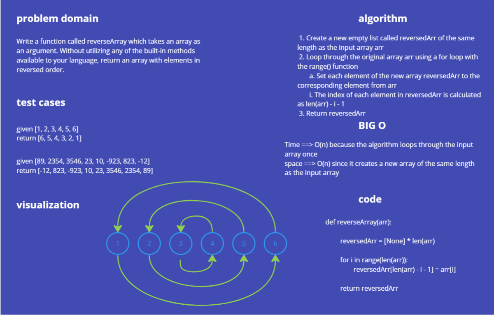

# array-reverse
Write a function called reverseArray which takes an array as an argument. Without utilizing any of the built-in methods available to your language, return an array with elements in reversed order.

# Whiteboard Process

# Approach & Efficiency

## Approach:
The approach of the solution is to create a new empty list called reversedArr of the same length as the input array. Then loop through the original array and set each element of the new array to the corresponding element from the original array. The index of each element in the new array is calculated as len(arr) - i - 1, which is the index of the current element in the original array counting from the end of the array. Finally, the function returns reversedArr, which contains the reversed elements of the original arr.

## Efficiency:
The time complexity of this solution is O(n), where n is the length of the input array. This is because the algorithm loops through the input array once to create the reversed array.

The space complexity of this solution is also O(n), since it creates a new array of the same length as the input array to store the reversed elements.

# Solution

 ## Create a function that takes an array

    def reverseArray(arr):
 ## Create a new empty list of the same length as the input array
         reversedArr = [None] * len(arr)

 ## Loop through the original array in reverse order
          for i in range(len(arr)):
              # Set each element of the new array to the corresponding element from the original array
               reversedArr[len(arr) - i - 1] = arr[i]

 ## Return the reversed array
         return reversedArr

## example 
#
arr1 = [1, 2, 3, 4, 5]
##
reversedArr1 = reverseArray(arr1)
##
print(reversedArr1) 
##
Output: [5, 4, 3, 2, 1]

