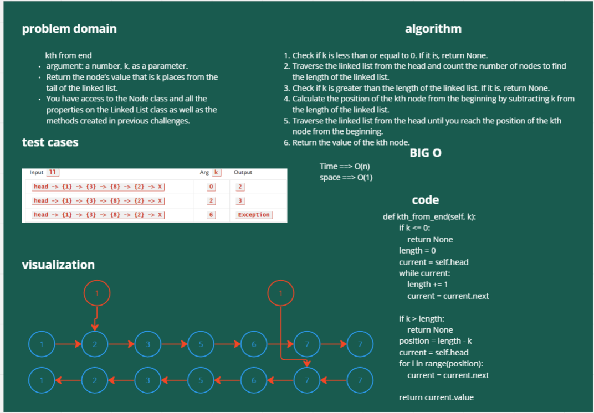
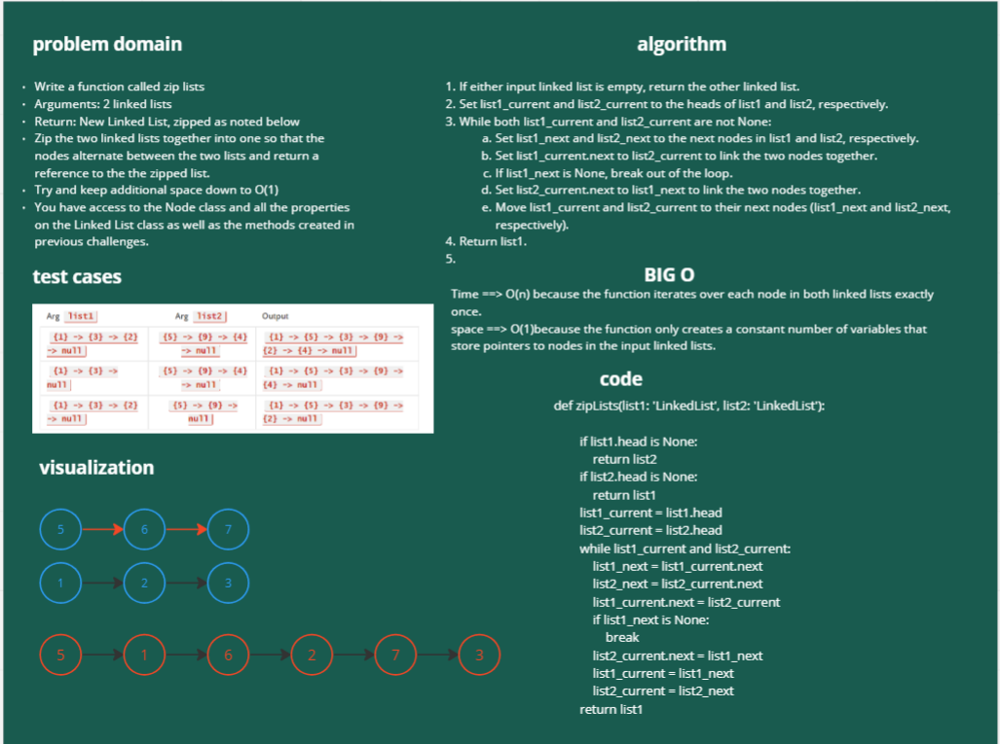
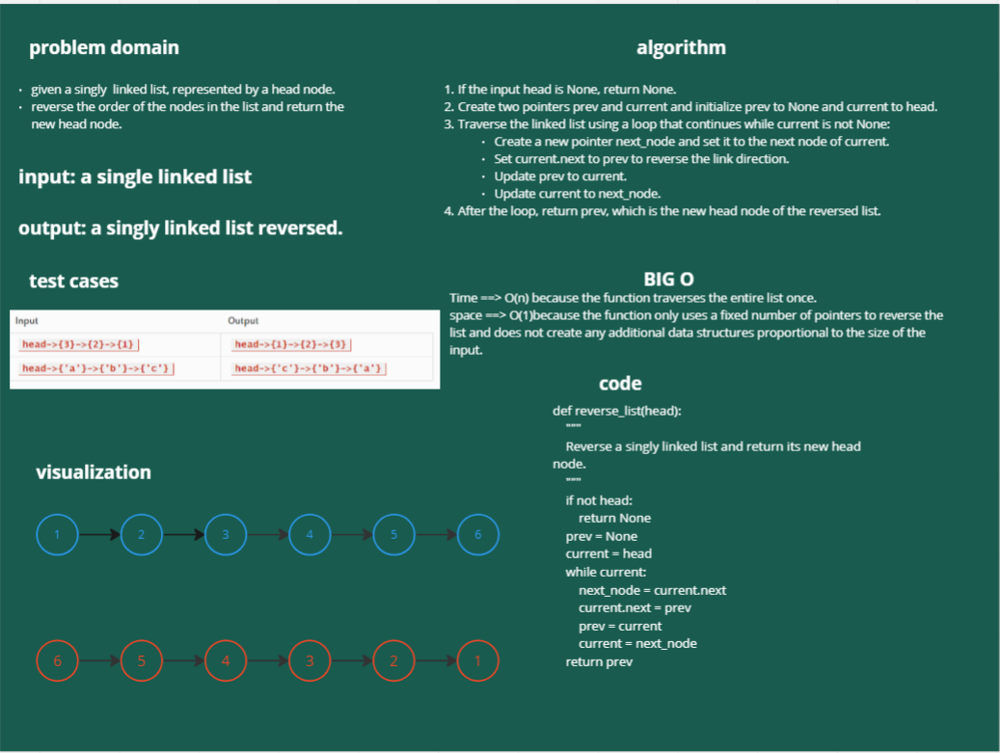

# Linked List

> - Create a Node class that has properties for the value stored in the Node, and a pointer to the next Node.

> - adding a node to the end of the linked list

> - arguments: value, new value
    adds a new node with the given new value immediately before the first node that has the value specified

> - arguments: value, new value
    adds a new node with the given new value immediately after the first node that has the value specified

## Approach & Efficiency

## big(o) for insert
> - Time --> O(1) because there no looping over the list
> - space -->O(1) because there is no use of an extra space

## big(o) for append
> - Time --> O(n) 
> - space -->O(1) 

## big(o) for insert-befor
> - Time --> O(n) 
> - space -->O(1) 

## big(o) for insert-after
> - Time --> O(n) 
> - space -->O(1) 

## big(o) for kth_from_end
> - Time --> O(n) 
> - space -->O(1) 
## big(o) for zipLists
> - Time ==> O(n) because the function iterates over each node in both linked lists exactly once.
> - space ==> O(1)because the function only creates a constant number of variables that store pointers to nodes in the input linked lists. 
## big(o) for reverse_list
> - Time ==> Time ==> O(n) because the function traverses the entire list once.
> - space ==> space ==> O(1)because the function only uses a fixed number of pointers to reverse the list and does not create any additional data structures proportional to the size of the input.

linked-list-insertions
# Whiteboard Process links
## insert

## append

## insert-befor

## insert-after

## kth_from_end

## zipLists

## reverse_list

## Solution
///   -->

  class LinkedList:

    def __init__(self):
        """
        Initialize a LinkedList instance.
        """
        self.head = None

    def insert(self,value):
        """
        Insert a node with the given value at the beginning of the linked list.

        Parameters:
        - value: Any data type
          The value to be stored in the new node.
        """
      
        node =Node(value)
        if self.head == None:
            self.head = node 
        else:
            node.next = self.head
            self.head = node        

    
    def includes (self,key):
        """
        Check whether the linked list contains a node with the given value.

        Parameters:
        - key: Any data type
          The value to search for.

        Returns:
        - bool
          True if the value is found in any node of the linked list, False otherwise.
        """
       
        temp = self.head
        if temp is None:
              return False
        while temp is not None:
              if temp.value == key:
                   return True
              temp = temp.next
        return False

    def append(self,value):

        """
        Insert a node with the given value at the end of the linked list.

        Parameters:
        - value: Any data type
          The value to be stored in the new node.
        """
       
        node = Node(value)
        
        if self.head is None:
            self.head = node
        else:
            current = self.head
            while current.next is not None:
                current = current.next
            current.next = node

    def insert_after(self,target,value):
         
         """
        Insert a node with the given value after the first node with the given target value.

        Parameters:
        - target: Any data type
          The value of the node after which the new node should be inserted.
        - value: Any data type
          The value to be stored in the new node.
        """
       
         if self.includes(target):
            node = Node(value)
            if self.head == None :
              self.insert(value)

            else:
              currnet = self.head
              while currnet.value is not target:
                   currnet = currnet.next
              target = currnet 
              node.next = target.next
              target.next = node
         else:
             print("this target value does not exists")

    def insert_before(self,target,value):

         """
        Insert a node with the given value before the first node with the given target value.

        Parameters:
        - target: Any data type
          The value of the node before which the new node should be inserted.
        - value: Any data type
          The value to be stored in the new node.
        """
        
         if self.includes(target):
            node = Node(value)
            if self.head == None or self.head.value == target:
              self.insert(value)

            else:
              currnet = self.head
              while currnet.next.value is not target:
                   currnet = currnet.next
              target = currnet 
              node.next = target.next
              target.next = node
         else:
             print("this target value does not exists")               
     
         
    def __str__(self):
        """
        Generate a string representation of the linked list.

        Returns:
        - str
          A string representation of the linked list.
        """
        output = ""
        if self.head is None:
            output = "Empty LinkeList"
        else:
            current = self.head
            while(current):
                output += f'{current.value} -> '
                current = current.next
            
            output += " None"
        return output  
                          
              -->
    def kth_from_end(self, k):
        """
    Returns the value of the kth node from the end of the linked list.

    Args:
    - self: the linked list object
    - k (int): the position of the node, counting from the end of the list

    Returns:
    - The value of the kth node from the end of the list, or None if k is less than or equal to 0, or if k is greater than the length of the list.

        """
        
        if k <= 0:
            return None

        # Get the length of the linked list
        length = 0
        current = self.head
        while current:
            length += 1
            current = current.next

        if k > length:
            return None

        # Calculate the position of the kth node from the beginning
        position = length - k

        # Traverse the linked list to find the kth node from the beginning
        current = self.head
        for i in range(position):
            current = current.next

        return current.value

    def find_middle(self):
        """
    Returns the value of the middle node of the linked list.

    Args:
    - self: the linked list object

    Returns:
    - The value of the middle node of the list, or None if the list is empty.

        """
        if not self.head:
            return None

        slow = self.head
        fast = self.head

        # Traverse the linked list using two pointers,
        # one moving at half the speed of the other.
        # When the fast pointer reaches the end of the
        # list, the slow pointer will be at the middle node.
        while fast and fast.next:
            slow = slow.next
            fast = fast.next.next

        return slow.value

    def zipLists(list1: 'LinkedList', list2: 'LinkedList'):
        """
        Zip two linked lists together so that the nodes alternate between the two lists and return a reference to the zipped list.

        """

        if list1.head is None:
            return list2
        if list2.head is None:
            return list1
        list1_current = list1.head
        list2_current = list2.head
        while list1_current and list2_current:
            list1_next = list1_current.next
            list2_next = list2_current.next
            list1_current.next = list2_current
            if list1_next is None:
                break
            list2_current.next = list1_next
            list1_current = list1_next
            list2_current = list2_next
        return list1

def reverse_list(head):
    """
    Reverse a singly linked list and return its new head node.

    """
    if not head:
        return None
    prev = None
    current = head
    while current:
        next_node = current.next
        current.next = prev
        prev = current
        current = next_node
    return prev

