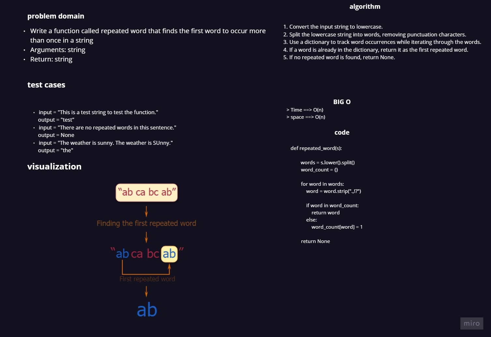

# hashmap-repeated-word

> repeated word

Write a function called repeated word that finds the first word to occur more than once in a string
Arguments: string
Return: string

# Approach & Efficiency

time complixity : O(n)

space complixity : O(n)

# white-board

## Merge Sort

# Solution 

    def repeated_word(s):
        """
        Find the first word that occurs more than once in a given string.

        Arguments:
        s (str)

        Returns:
        str or None
        """
        words = s.lower().split()
        word_count = {}

        for word in words:
            word = word.strip(".,!?")

            if word in word_count:
                return word
            else:
                word_count[word] = 1

        return None