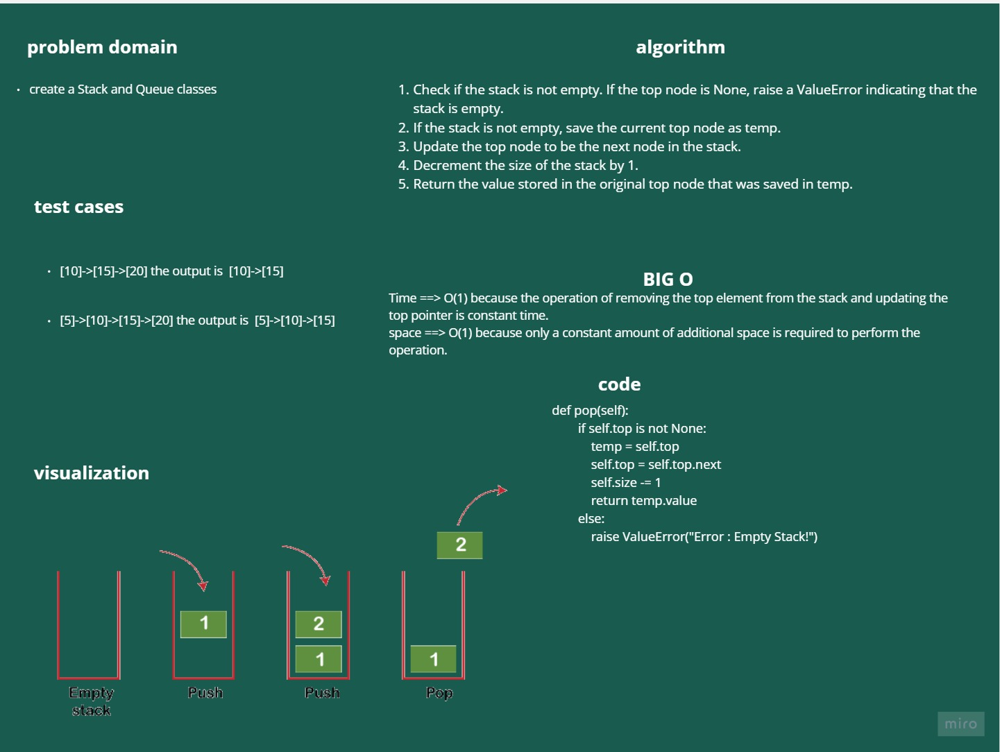

# Stacks and Queues

create a Stack and Queue classes

# Whiteboard Process

## pop 



# Approach & Efficiency

# Approach

This code defines a pop() method for a stack data structure. If the stack is not empty, the method removes the top element from the stack and returns its value. If the stack is empty, the method raises a ValueError with a message indicating that the stack is empty.

# Efficiency

Time ==> O(1) because the operation of removing the top element from the stack and updating the top pointer is constant time. 
space ==> O(1) because only a constant amount of additional space is required to perform the operation.

# Solution

## Queue

```class Queue:
    def __init__(self):
        self.front = None
        self.rear = None

    def enqueue(self,value):
        node = Node(value)
        #if the queue is empty
        if not self.rear:
            self.front = node
            self.rear = node
        else:
            self.rear.next = node
            self.rear = node

    def dequeue(self):

        #if the queue is empty
        if self.front == None:
            raise IndexError("Error : Empty Queue!")
        # if the queue contains only one node
        if self.front == self.rear:
            self.rear = None
            #self.front = None
        temp = self.front
        self.front = self.front.next
        temp.next = None

        return temp.value

    def peek(self):
        if self.front == None:
            raise IndexError("Error : Empty Queue!")
        return self.front.value

    def is_empty(self):
        return self.front== None

    def __str__(self):
        output = ""
        if self.front is None:
            output = "Empty Queue!"
        else:
            current = self.front
            while(current):
                output += f'{current.value} --> '
                current = current.next

            output += " None"
        return output
```

## Stack

```
class Stack:

    def __init__(self):
        self.top = None
        self.size = 0

    def push(self,value):
        node = Node(value)
        if self.top:
            node.next = self.top
        self.top = node
        self.size += 1

    def pop(self):
        if self.top is not None:
            temp = self.top
            self.top = self.top.next
            self.size -= 1
            return temp.value
        else:
            raise ValueError("Error : Empty Stack!")

    def peek(self):
        if self.top:
            return self.top.value
        else:
            raise ValueError("Error : Empty Stack!")

    def get_size(self):
        return self.size

    def is_empty(self):
        return self.size == 0

    def __str__(self):
        output = ""
        if self.top is None:
            output = "Empty Stack!"
        else:
            current = self.top
            while(current):
                output += f'{current.value} --> '
                current = current.next

            output += " None"
        return output
```