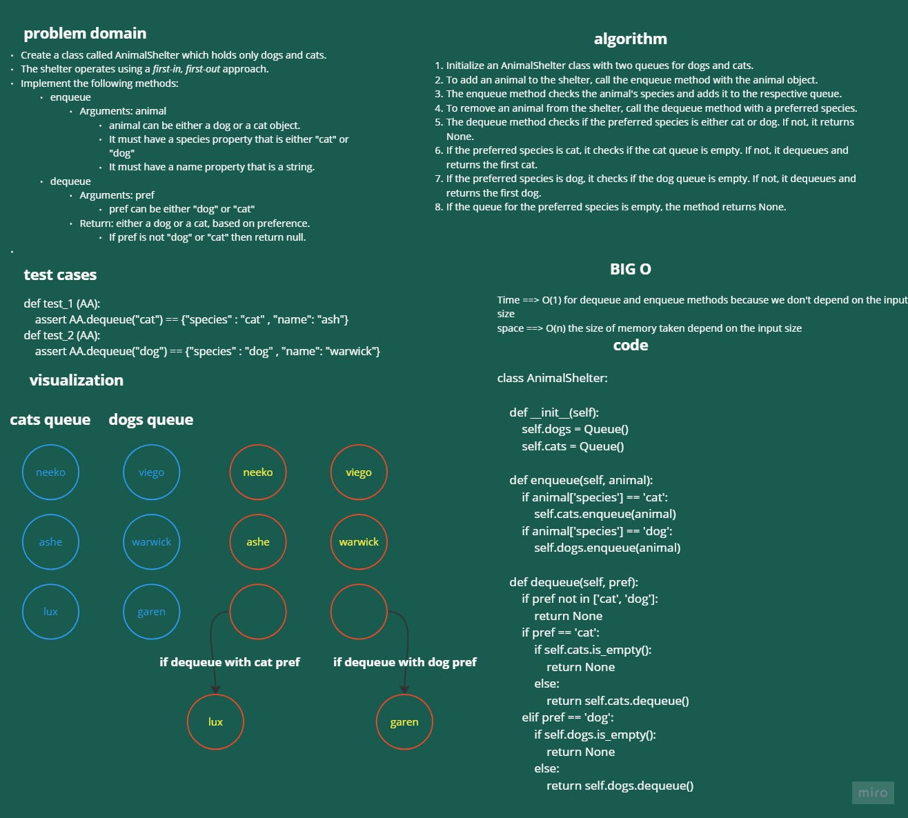

# stack-queue-animal-shelter

Create a class called AnimalShelter which holds only dogs and cats.
The shelter operates using a first-in, first-out approach.
Implement the following methods:
## enqueue

Arguments: animal
animal can be either a dog or a cat object.
It must have a species property that is either "cat" or "dog"
It must have a name property that is a string.

## dequeue

Arguments: pref
pref can be either "dog" or "cat"
Return: either a dog or a cat, based on preference.
If pref is not "dog" or "cat" then return null.

# Whiteboard Process

# Approach & Efficiency

Time ==> O(1) for dequeue and enqueue methods because we don't depend on the input size
space ==> O(n) the size of memory taken depend on the input size

# Solution

    class AnimalShelter:
        """
        This code defines an AnimalShelter class that has two queues, one for cats and one for dogs. 
        """
        def __init__(self):
            self.dogs = Queue() 
            self.cats = Queue() 

        """
        this function that takes an object representing an animal as input and enqueues it into the corresponding queue based on its species (either "cat" or "dog").
        """
        def enqueue(self, animal):
            if animal['species'] == 'cat':
                self.cats.enqueue(animal)
            if animal['species'] == 'dog':
                self.dogs.enqueue(animal)

        """
        The dequeue function takes a string representing the animal's species ("cat" or "dog") as input and dequeues the animal at the front of the corresponding queue
        """
        def dequeue(self, pref):
            if pref not in ['cat', 'dog']:
                return None
            if pref == 'cat':
                if self.cats.is_empty():
                    return None
                else:
                    return self.cats.dequeue()
            elif pref == 'dog':
                if self.dogs.is_empty():
                    return None
                else:
                    return self.dogs.dequeue()
            