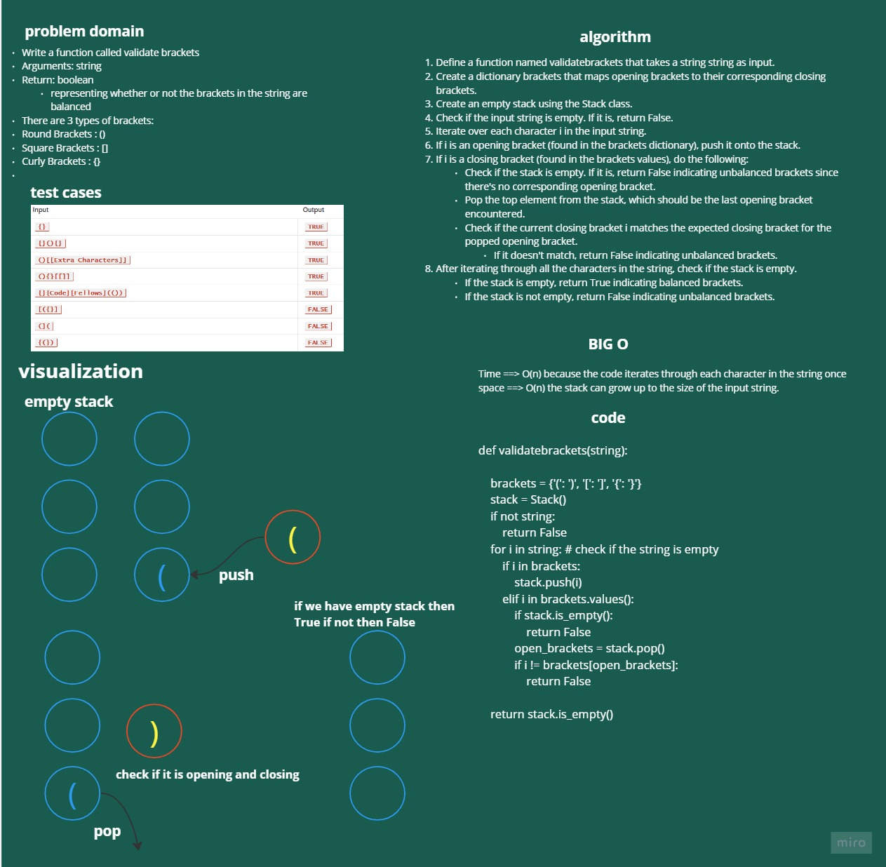

# stack_queue_brackets

Write a function called validate brackets
Arguments: string
Return: boolean
representing whether or not the brackets in the string are balanced
There are 3 types of brackets:
Round Brackets : ()
Square Brackets : []
Curly Brackets : {}

# Whiteboard Process

# Approach & Efficiency

Time ==> O(n) because the code iterates through each character in the string once
space ==> O(n) the stack can grow up to the size of the input string.

# Solution

    def validatebrackets(string):

        brackets = {'(': ')', '[': ']', '{': '}'}
        stack = Stack()
        if not string:
            return False
        for i in string: # check if the string is empty
            if i in brackets:
                stack.push(i)
            elif i in brackets.values():
                if stack.is_empty():
                    return False
                open_brackets = stack.pop()
                if i != brackets[open_brackets]:
                    return False

        return stack.is_empty()