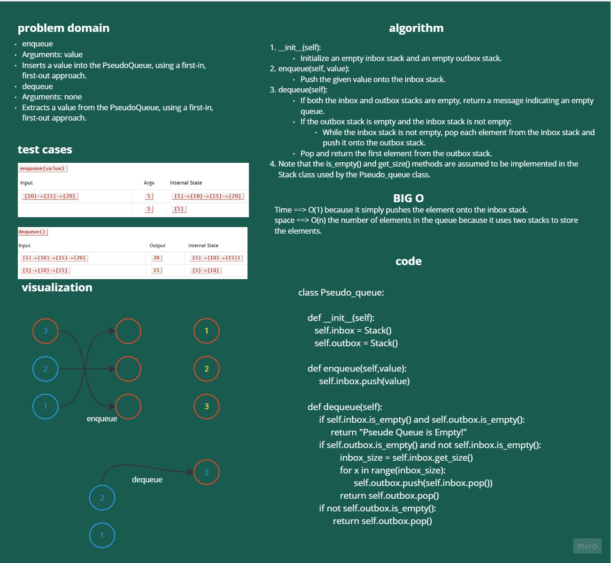

# stack_queue_pseudo 
## enqueue
Arguments: value
Inserts a value into the PseudoQueue, using a first-in, first-out approach.
## dequeue
Arguments: none
Extracts a value from the PseudoQueue, using a first-in, first-out approach.

# Whiteboard Process

# Approach & Efficiency

## Approach:

This code implements a queue data structure using two stacks. The inbox stack is used to store incoming elements, and the outbox stack is used to store elements in the order they will be dequeued. When an element is dequeued, the elements in the inbox stack are moved to the outbox stack in reverse order so that the first element added to the queue is the first to be dequeued.

To enqueue an element, it is simply pushed onto the inbox stack. To dequeue an element, the function first checks if both stacks are empty, in which case it returns a message indicating that the pseudo queue is empty. If the outbox stack is empty, it moves all the elements from the inbox stack to the outbox stack in reverse order. Finally, it returns the first element in the outbox stack.

## Efficiency:
The time complexity of enqueue operation is O(1) because it simply pushes the element onto the inbox stack.
The space complexity is O(n) where n is the number of elements in the queue because it uses two stacks to store the elements.

# Solution

    class Pseudo_queue:
        """
        A class that implements a queue using two stacks.

        Attributes:
        - inbox (Stack): A stack used to store incoming elements.
        - outbox (Stack): A stack used to store elements in the order they will be dequeued.

        Methods:
        - enqueue(value): Adds a new element to the queue.
        - dequeue(): Removes and returns the first element in the queue, or returns "The Queue is empty" if the queue is empty.
        
        """
        def __init__(self):
        self.inbox = Stack()
        self.outbox = Stack()

        def enqueue(self,value):
            self.inbox.push(value)

        def dequeue(self):
            if self.inbox.is_empty() and self.outbox.is_empty():
                return "Pseude Queue is Empty!"
            if self.outbox.is_empty() and not self.inbox.is_empty():
                    inbox_size = self.inbox.get_size()
                    for x in range(inbox_size):
                            self.outbox.push(self.inbox.pop())
                    return self.outbox.pop()
            if not self.outbox.is_empty():             
                return self.outbox.pop()
