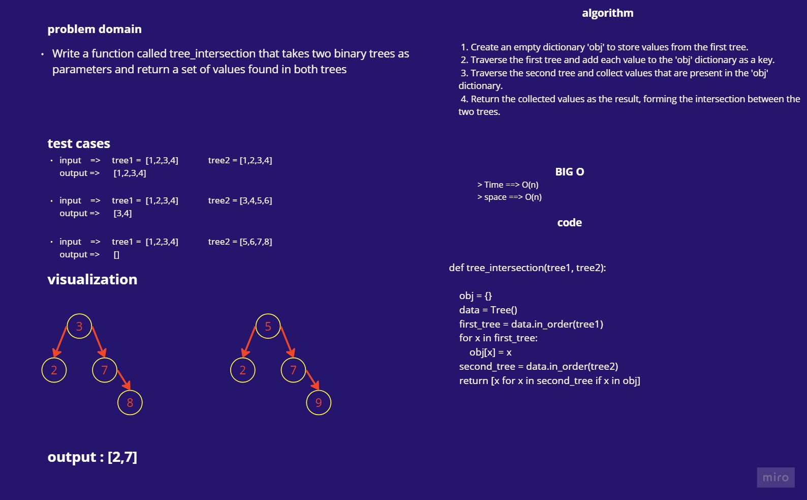

# tree_intersection

> tree_intersection

Write a function called tree_intersection that takes two binary trees as parameters and return a set of values found in both trees

# Approach & Efficiency

time complixity : O(n)

space complixity : O(n)

# white-board

## tree intersection 

# Solution 

    def tree_intersection(Tree1, Tree2):
        """
        takes two binary trees and returns the intersection values between them.

        arguments: 
            two binary trees

        returns: 
            list of intersection values
        """
        obj = Hashtable()
        data = Tree()
        first_tree = data.in_order(Tree1)
        # print(first_tree)
        for x in first_tree:
            obj.set(x ,x)
        second_tree = data.in_order(Tree2)
        return [x for x in second_tree if obj.has(x)]