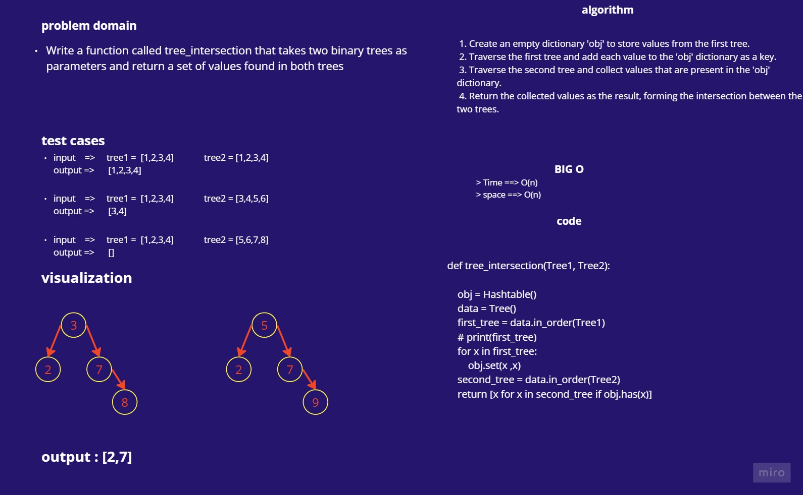

# tree_intersection

> tree_intersection

Write a function called tree_intersection that takes two binary trees as parameters and return a set of values found in both trees

# Approach & Efficiency

time complixity : O(n)

space complixity : O(n)

# white-board

## Merge Sort

# Solution 

    def tree_intersection(tree1, tree2):
        """
        Returns a list of intersection values between two binary trees.

        Args:
            tree1: The first binary tree.
            tree2: The second binary tree.

        Returns:
            A list of intersection values found in both trees.
        """
        obj = {}
        data = Tree()
        first_tree = data.in_order(tree1)
        for x in first_tree:
            obj[x] = x
        second_tree = data.in_order(tree2)
        return [x for x in second_tree if x in obj]